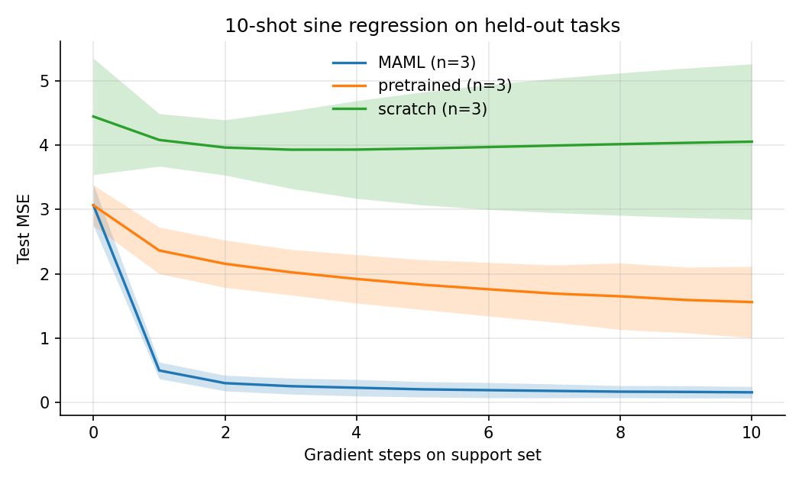
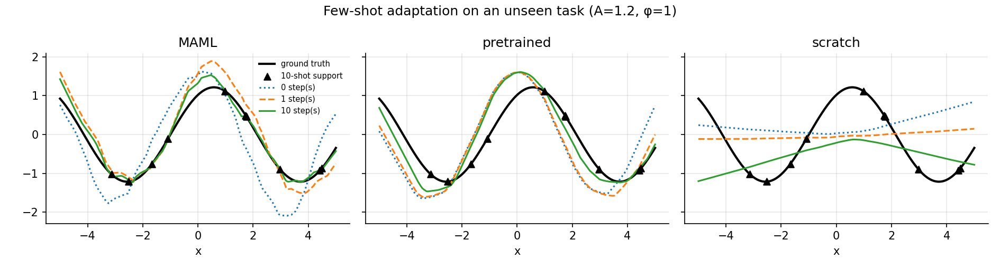
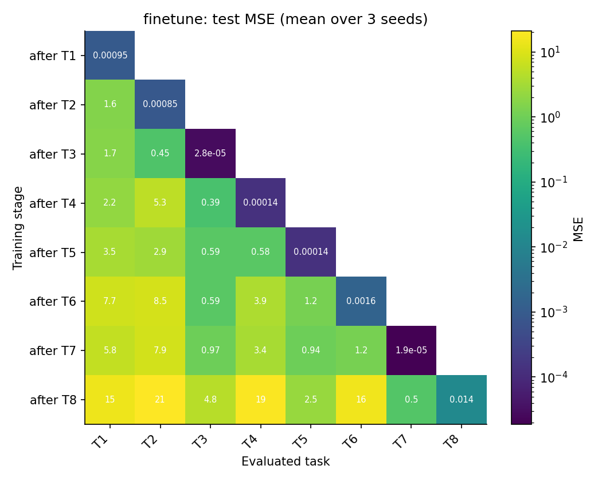
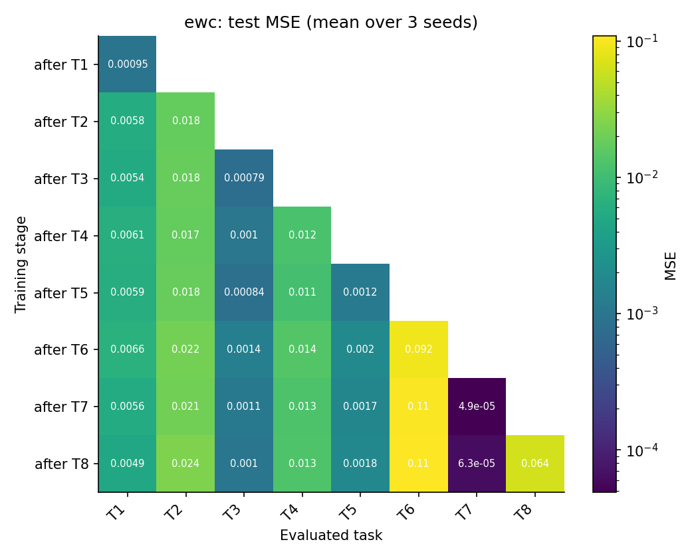
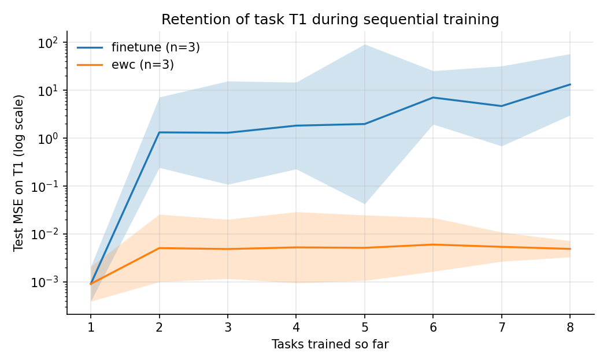
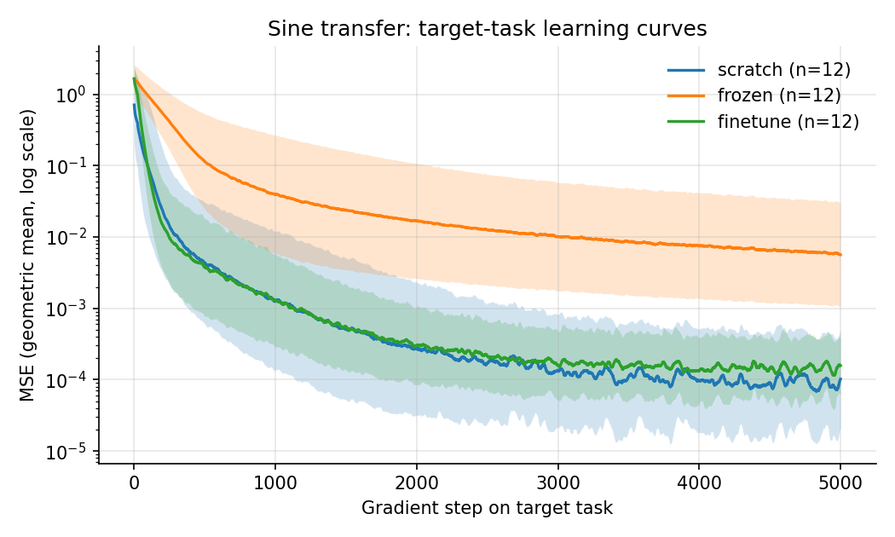

<div align="center">

# CTRL — Cross-Task Reinforcement Learning

**A reproducible research framework for transfer, meta- and continual learning across related decision-making tasks.**

[](https://github.com/ak811/ctrl/actions/workflows/ci.yml)


[](https://github.com/astral-sh/ruff)
[](LICENSE)

[Methods](docs/methods.md) · [Experiments](docs/experiments.md) · [Architecture](docs/architecture.md) · [Changelog](CHANGELOG.md)

</div>

---

## Overview

Agents that learn every task from scratch waste experience. CTRL studies three complementary ways of reusing it, under a single, controlled experimental harness:

| Paradigm | Question | Methods | Package |
|---|---|---|---|
| **Transfer learning** | Does a visual representation learned in one game accelerate learning in another? | PPO with a shared Nature-CNN encoder; scratch vs. fine-tuned vs. frozen encoder | [`transfer/`](transfer) |
| **Meta-learning** | Can we learn an initialisation that adapts to an *unseen* task in a handful of policy-gradient steps? | Reptile over REINFORCE; multi-task pretraining and random-init controls | [`meta/`](meta) |
| **Continual learning** | Can a network learn a sequence of tasks without catastrophically forgetting earlier ones? | EWC (per-task and online) with true Fisher; MAML and supervised transfer on a controlled benchmark | [`continual/`](continual) |

All paradigms share the same infrastructure: typed configurations, seeded task distributions with disjoint train/test splits, provenance-tracked run directories, and confidence-interval reporting.

### Highlights

- **Task distributions, not single environments.** Snake, PuckWorld and Pong are exposed as *families* of MDPs (permuted controls, perturbed dynamics, game modes/difficulties) with held-out test tasks, so adaptation and transfer are always measured on unseen tasks.
- **Correct, verified algorithms.** Functional second-order MAML (`torch.func`), true-Fisher EWC via per-sample Jacobians (`vmap`), batched Reptile, and strict name/shape-checked PPO weight transfer. Every previously broken component has a regression test ([what was fixed](#whats-new-in-020)).
- **Standard metrics.** Jumpstart, asymptotic performance, normalised AUC and transfer ratio (Taylor & Stone, 2009); backward transfer and forgetting (Lopez-Paz & Ranzato, 2017; Chaudhry et al., 2018); all reported as mean ± 95 % CI.
- **Reproducible by construction.** Explicit RNGs everywhere, common random numbers across compared methods, and a resolved `config.yaml` plus `metadata.json` (git commit, package versions, platform) written to every run.
- **Engineering.** Installable package with console scripts, 40 unit/integration tests, GitHub Actions CI on Python 3.10–3.12, Ruff, pre-commit, Docker and a Makefile.

---

## Repository structure

```
ctrl/
├── common/                 # shared infrastructure
│   ├── config.py           #   dataclass configs · YAML · auto-generated CLI
│   ├── io.py               #   run directories · provenance
│   ├── stats.py            #   95% CIs · normalised AUC
│   ├── plotting.py         #   learning curves · heatmaps
│   └── seed.py · logger.py · torch_utils.py
├── envs/                   # Gymnasium environments and task distributions
│   ├── snake.py            #   grid & image Snake
│   ├── puckworld.py        #   discrete-vector & continuous-image PuckWorld
│   ├── pong.py             #   ALE Pong wrappers (frame stack / 84×84)
│   ├── registry.py         #   make_env · CTRL/*-v0 registration
│   └── tasks.py            #   train/test task distributions for meta-RL
├── transfer/               # PPO cross-domain transfer (Stable-Baselines3)
│   ├── train.py · evaluate.py · analyze.py
│   ├── extractor.py        #   Nature-CNN encoder shared across games
│   ├── weights.py          #   load · transfer · freeze
│   └── env_factory.py · callbacks.py · config.py
├── meta/                   # Reptile meta-RL
│   ├── train.py · evaluate.py
│   ├── reptile.py · reinforce.py · policy.py
│   └── config.py
├── continual/              # sine-regression benchmark: transfer · MAML · EWC
│   ├── run.py              #   experiment driver → figures, RESULTS.md
│   ├── maml.py · ewc.py · transfer.py · metrics.py
│   └── data.py · models.py · config.py
├── configs/                # YAML experiment configurations
│   ├── transfer/  meta/  continual/
├── scripts/                # reproduction and smoke-test scripts
├── tests/                  # pytest suite
├── docs/                   # methods, protocols, architecture, figures
├── pyproject.toml · requirements.txt · Makefile · Dockerfile
└── CHANGELOG.md · CONTRIBUTING.md · CITATION.cff · LICENSE
```

---

## Installation

Python ≥ 3.10 is required. Use a virtual environment: the project installs its packages (`common`, `envs`, `transfer`, `meta`, `continual`) at the top level.

```bash
git clone https://github.com/ak811/ctrl.git && cd ctrl
python -m venv .venv && source .venv/bin/activate

pip install -e ".[atari,tensorboard]"     # runtime + Pong + TensorBoard
pip install -e ".[all]"                   # + video recording and dev tooling
```

- **CPU-only machines:** install PyTorch first to avoid the CUDA wheels:
  `pip install torch --index-url https://download.pytorch.org/whl/cpu`.
- **Atari ROMs** are bundled with `ale-py ≥ 0.10`; no separate licence step is needed.
- **Docker:** `docker build -t ctrl . && docker run --rm ctrl make smoke`.

Verify the installation (≈ 2 min on CPU):

```bash
make test     # unit + integration tests
make smoke    # runs every entry point end-to-end on tiny budgets
```

---

## Quick start

```bash
# Sine benchmark: supervised transfer, MAML and EWC (≈ 10 CPU-minutes)
python -m continual.run --config configs/continual/default.yaml

# Meta-RL: Reptile on PuckWorld, evaluated on held-out tasks
python -m meta.train --config configs/meta/puckworld.yaml --algorithm reptile --seed 0

# Transfer: Snake → PuckWorld with a frozen, pretrained encoder
python -m transfer.train --config configs/transfer/snake.yaml --run-name source
python -m transfer.train --config configs/transfer/puckworld.yaml \
    --init-from outputs/transfer/snake/source/final_model.zip --freeze-encoder
```

After `pip install -e .`, the same commands are available as console scripts: `ctrl-continual`, `ctrl-meta`, `ctrl-meta-eval`, `ctrl-transfer`, `ctrl-transfer-eval`, `ctrl-transfer-analyze`.

**Configuration** follows *dataclass defaults < `--config` YAML < CLI flags*. Every field is a flag (`maml_inner_lr` → `--maml-inner-lr`, booleans as `--flag/--no-flag`) and `--help` lists them all. Unknown YAML keys are rejected, so typos fail loudly.

---

## Environments

| Key | Observation | Action | Notes |
|---|---|---|---|
| `snake` | 8×8 grid ∈ {0, 0.5, 1, −1} (empty, body, head, food) | Discrete(4) | head encoded separately so the state is Markov |
| `snake_image` | (1, 84, 84) uint8 | Discrete(4) | PPO transfer variant |
| `puckworld` | ℝ⁶ (position, velocity, target) | Discrete(4) | configurable thrust, damping, goal radius |
| `puckworld_image` | (1, 84, 84) uint8 | Box(2) continuous thrust | dense potential-based shaping (default) or original sparse reward |
| `pong_stack` | (4, 40, 40) float | Discrete(3) | cropped grayscale ALE frames |
| `pong_image` | (1, 84, 84) uint8 | Discrete(3) | `ALE/Pong-v5` with sticky actions |

All environments pass `gymnasium.utils.env_checker.check_env`, are seeded through `reset(seed=…)`, and are registered as `CTRL/Snake-v0`, `CTRL/PuckWorldImage-v0`, etc. via `envs.register_envs()`.

**Task distributions** (`envs/tasks.py`) turn each game into a family of tasks. Snake and PuckWorld vary the mapping from actions to movements (24 permutations; 18 for meta-training, 6 held out) together with the reward scale or physics; Pong varies ALE game mode and difficulty (difficulty 3 is held out).

---

## Paradigms

### 1. Transfer learning with PPO

All games are rendered to 84×84 frames and stacked (k = 4), so a single **Nature-CNN** encoder can be shared between tasks with different action spaces. A source policy is trained with PPO, and its encoder (optionally also the shared MLP) is transplanted into a freshly initialised target policy, whose actor and critic heads are always re-initialised.

| Protocol | Flags | Trainable parameters |
|---|---|---|
| Scratch | — | all |
| Fine-tune encoder | `--init-from SRC.zip` | all |
| Frozen encoder | `--init-from SRC.zip --freeze-encoder` | MLP + heads |
| Encoder + MLP | `--init-from SRC.zip --transfer-layers encoder_mlp` | all |

Evaluation also runs at *t = 0* so that jumpstart can be measured. `transfer.analyze` aggregates seeds into learning curves and computes jumpstart, asymptotic return, normalised AUC and transfer ratio relative to scratch:

```bash
bash scripts/reproduce_transfer.sh snake puckworld 3   # source + 3 protocols × 3 seeds + analysis
```

### 2. Meta-reinforcement learning with Reptile

The inner loop runs *k* REINFORCE updates on a sampled training task. The outer loop moves the initialisation towards the mean of the adapted parameters,
φ ← φ + ε<sub>τ</sub> (mean<sub>i</sub> θ̃<sub>i</sub> − φ), with ε<sub>τ</sub> linearly annealed.

To separate the effect of *meta*-learning from that of simply seeing more data, CTRL includes a **multi-task pretraining** control that is trained on the same task batches without optimising for adaptability. It also includes a **random initialisation** control. All initialisations are adapted on the same held-out tasks with identical episode seeds.

```bash
bash scripts/reproduce_meta.sh puckworld 3   # Reptile vs multitask vs random, 3 seeds, 32 held-out tasks
```

### 3. Controlled benchmark: sine regression

A cheap, fully controlled supervised benchmark in which each paradigm can be measured precisely. Each task is y = A sin(x − φ) with A ∈ [0.1, 5] and φ ∈ [0, π].

- **Supervised transfer:** scratch vs. frozen trunk (linear probe) vs. full fine-tuning across four source → target pairs.
- **MAML** (Finn et al., 2017 protocol): 10-shot, one inner SGD step (α = 0.01), second-order meta-gradient, compared against multi-task pretraining and scratch on 100 held-out tasks.
- **Continual learning:** eight tasks learned sequentially in the task-incremental (multi-head) or domain-incremental (single-head) scenario, comparing naive fine-tuning against EWC with per-task or online penalties.

```bash
bash scripts/reproduce_continual.sh
```

The full mathematical treatment is in [`docs/methods.md`](docs/methods.md), and run protocols and outputs are documented in [`docs/experiments.md`](docs/experiments.md).

---

## Results

### Sine-regression benchmark

Produced by `scripts/reproduce_continual.sh` (configuration [`configs/continual/default.yaml`](configs/continual/default.yaml), 3 seeds, CPU). Values are mean ± 95 % CI half-width; lower is better for every MSE.

**Few-shot adaptation (MAML).** Test MSE on 100 held-out tasks after *n* SGD steps on a 10-point support set.

| Initialisation | MSE @ 0 steps | MSE @ 1 step | MSE @ 10 steps |
|---|---|---|---|
| **MAML** | 3.07 ± 0.32 | **0.50 ± 0.13** | **0.16 ± 0.09** |
| Multi-task pretrained | 3.06 ± 0.31 | 2.36 ± 0.36 | 1.56 ± 0.55 |
| Scratch | 4.44 ± 0.90 | 4.08 ± 0.41 | 4.05 ± 1.20 |

<p align="center">
  
  
</p>

Before adaptation, MAML and multi-task pretraining are indistinguishable: both predict roughly the mean function. After a single gradient step, the MAML initialisation reaches **4.7× lower error** than the pretrained baseline, and after ten steps the gap grows to **~10×**. This reproduces the qualitative result of Finn et al. (2017). The effect comes entirely from the meta-objective, because both models are trained on the same task distribution.

**Continual learning (8 tasks, task-incremental, λ = 100).**

| Method | Avg. final MSE | Avg. learning MSE (plasticity) | BWT ↓ | Forgetting ↓ |
|---|---|---|---|---|
| Fine-tune | 9.83 ± 5.1 | **0.0022 ± 0.0005** | 11.2 ± 5.8 | 11.2 ± 5.8 |
| **EWC** | **0.027 ± 0.027** | 0.024 ± 0.021 | **0.0042 ± 0.0065** | **0.0044 ± 0.0066** |

<p align="center">
  
  
  
</p>

With naive fine-tuning, the shared trunk drifts and earlier tasks collapse. The mean final error is more than three orders of magnitude higher than what was achieved when each task was learned. EWC reduces backward transfer from 11.2 to 0.004 (the CI includes zero) and lowers the average final MSE by **~360×**. The cost is the stability–plasticity trade-off: per-task learning error is about 10× higher, because the penalty constrains parameters that later tasks would like to reuse.

**Supervised transfer (4 source → target pairs × 3 seeds).**

| Mode | Jumpstart MSE | Final MSE | AUC (mean log₁₀ MSE) ↓ |
|---|---|---|---|
| Scratch | 2.23 ± 1.6 | 7.0e-4 ± 7.2e-4 | −3.46 ± 0.82 |
| Fine-tune | 2.13 ± 1.1 | **3.4e-4 ± 2.1e-4** | −3.38 ± 0.52 |
| Frozen trunk | 2.14 ± 1.2 | 3.6e-2 ± 2.4e-2 | −1.72 ± 0.73 |

<p align="center">
  
</p>

Transfer between sine tasks with different amplitude and phase gives **no reliable benefit**. Fine-tuning and training from scratch are statistically indistinguishable in jumpstart and AUC; the arithmetic-mean final MSE favours fine-tuning, but the geometric-mean curves overlap. Freezing the trunk is clearly harmful: the source representation cannot express the target function, and final error is ~100× higher. This is a useful negative control. It shows that naive parameter reuse is not automatically beneficial, and that the adaptability MAML exhibits above is a property of *meta*-training rather than of pretraining per se.

### Reinforcement-learning studies

The RL studies (PPO transfer, Reptile meta-RL) need several GPU-hours to GPU-days at the budgets in `configs/`, and **no numbers are reported here**. Run `scripts/reproduce_transfer.sh` and `scripts/reproduce_meta.sh` to produce them. Each writes a Markdown/JSON metrics table and publication-ready figures into `outputs/`. The protocols are fully specified in [`docs/experiments.md`](docs/experiments.md).

---

## Outputs and reproducibility

Every run creates a directory that is never overwritten:

```
outputs/<paradigm>/<env>/<run-name>/
├── config.yaml        # fully resolved configuration — re-run with --config
├── metadata.json      # command, git commit, Python / package versions, platform, CUDA
├── *.log              # structured training log
├── *.csv / *.npz      # raw curves (per step / per evaluation)
├── summary.json       # aggregated metrics with 95% CIs
└── *.png              # figures
```

All randomness flows from the `seed` field through explicitly passed generators. Competing methods are evaluated with identical task and episode seeds, so comparisons are paired. GPU runs are reproducible up to the non-determinism of cuDNN kernels.

---

## Development

```bash
make install-dev   # editable install with all extras + pre-commit hooks
make lint          # ruff check + ruff format --check
make test          # pytest with coverage
make smoke         # end-to-end CLI run
```

The test suite covers configuration parsing, Gymnasium API compliance and determinism for every environment, Pong preprocessing, gradient flow through MAML, Fisher computation and multi-task EWC protection, REINFORCE edge cases, Reptile updates, PPO weight transfer and encoder freezing. It also contains a regression test for each bug fixed in 0.2.0. CI runs lint, the test matrix on Python 3.10–3.12 and the smoke test on every push.

See [`CONTRIBUTING.md`](CONTRIBUTING.md) for conventions and [`docs/architecture.md`](docs/architecture.md) for how to add a new environment or method.

---

## What's new in 0.2.0

**Correctness fixes**

- MAML never updated its meta-parameters.
- PPO transfer crashed on start-up because of a redundant image transpose.
- Pong failed to load on Gymnasium ≥ 1.0.
- REINFORCE produced NaN on one-step episodes.
- EWC protected only the most recent task and used a biased empirical Fisher.
- The environments used unseeded RNGs.
- Snake had a tail-collision bug, did not distinguish head from body, and could loop forever on a full board.

**Additions:** actual cross-domain weight transfer, task distributions with held-out splits, multi-task and random baselines, continual-learning metrics, CI reporting, a typed configuration system, and the test suite, CI, packaging and documentation.

**Structural change:** the `src/ctrl/` layout was flattened so that packages live at the repository root.

Full details are in [`CHANGELOG.md`](CHANGELOG.md).

---

## Citation

```bibtex
@software{ctrl2026,
  title   = {{CTRL}: Cross-Task Reinforcement Learning},
  author  = {ak811},
  year    = {2026},
  version = {0.2.0},
  url     = {https://github.com/ak811/ctrl}
}
```

## References

Finn et al., *Model-Agnostic Meta-Learning*, ICML 2017 · Nichol et al., *On First-Order Meta-Learning Algorithms*, 2018 · Kirkpatrick et al., *Overcoming Catastrophic Forgetting*, PNAS 2017 · Schwarz et al., *Progress & Compress*, ICML 2018 · Schulman et al., *Proximal Policy Optimization*, 2017 · Mnih et al., *Human-level Control through Deep RL*, Nature 2015 · Taylor & Stone, *Transfer Learning for RL Domains*, JMLR 2009 · Lopez-Paz & Ranzato, *Gradient Episodic Memory*, NeurIPS 2017. See [`docs/methods.md`](docs/methods.md) for the full list.

## License

Released under the [MIT License](LICENSE).
