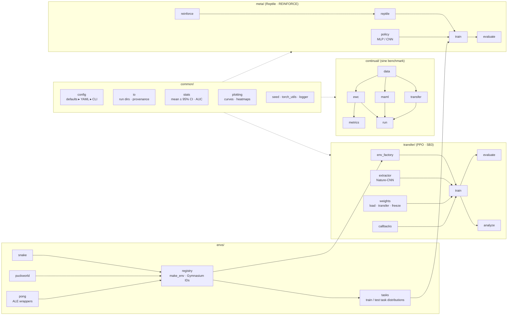

# Architecture

CTRL is organised as five importable top-level packages — one shared infrastructure layer, one environment layer and three paradigm packages — plus declarative configs, reproduction scripts and tests.

## Module map

| Package | Module | Responsibility |
|---|---|---|
| `common` | `config.py` | Typed dataclass configs; YAML loading with unknown-key validation; automatic `argparse` flag generation (tuples, booleans, optionals) |
| | `io.py` | Non-clobbering run directories, CSV/JSON/YAML writers, provenance capture (`config.yaml`, `metadata.json`) |
| | `seed.py`, `torch_utils.py`, `logger.py` | Global seeding (optionally deterministic cuDNN), device resolution (`auto`/`cpu`/`cuda`/`mps`), structured logging to console + file |
| | `stats.py`, `plotting.py` | Student-t confidence intervals, normalised AUC; headless Matplotlib curves with CI bands and NaN-aware heatmaps |
| `envs` | `snake.py`, `puckworld.py`, `pong.py` | Vector- and image-observation variants of each game; all pass `gymnasium.utils.env_checker.check_env` |
| | `registry.py` | `make_env(key, **kwargs)` and Gymnasium registration (`CTRL/Snake-v0`, …) |
| | `tasks.py` | `TaskSpec` / `TaskDistribution` with disjoint train/test splits for meta-learning |
| `transfer` | `train.py` | PPO training, optional weight transfer / freezing, t = 0 evaluation, checkpoints |
| | `weights.py` | Loading policy tensors from SB3 archives, prefix-filtered strict transfer, encoder freezing |
| | `analyze.py`, `evaluate.py` | Cross-seed transfer metrics and learning curves; policy roll-outs and optional video |
| `meta` | `reinforce.py`, `reptile.py` | Batched REINFORCE loss, episode collection, in-place adaptation, Reptile outer update |
| | `train.py`, `evaluate.py` | Meta-training loop with held-out evaluation; checkpoint I/O and multi-seed comparison reports |
| `continual` | `transfer.py`, `maml.py`, `ewc.py` | Supervised transfer, functional MAML/FOMAML, true-Fisher EWC (separate & online) |
| | `metrics.py`, `run.py` | Accuracy-matrix metrics; experiment driver producing figures, `summary.json`, `RESULTS.md` |

## Design principles

**Configuration as data.** Each paradigm owns one frozen or validated dataclass. The YAML files in `configs/` are partial overrides of those defaults, and the CLI is generated from the dataclass so documentation, validation and flags never drift apart. The resolved configuration is written into every run directory, so a run can be re-launched with `--config <run>/config.yaml`.

**Explicit randomness.** No module relies on hidden global RNG state. Environments seed their generator through `reset(seed=…)`; data samplers take a `numpy.random.Generator`; evaluation of competing methods reuses identical seeds (common random numbers), which substantially reduces the variance of paired comparisons.

**Train/test separation at the task level.** Meta-learning and transfer claims are only meaningful on tasks not seen during (meta-)training; `envs/tasks.py` enforces disjoint splits and the evaluation code only draws from the test split.

**Thin wrappers over established libraries.** PPO is Stable-Baselines3; MAML uses `torch.func`; environments are standard Gymnasium environments usable outside this project.

## Adding a new environment

1. Implement a `gymnasium.Env` in `envs/<name>.py` (vector and/or `(C, 84, 84)` uint8 image observation).
2. Add its key to `ENTRY_POINTS` in `envs/registry.py`.
3. For meta-learning, subclass `TaskDistribution` in `envs/tasks.py` with disjoint `train`/`test` splits and add it to `TASK_DISTRIBUTIONS`.
4. For transfer, add the key to `transfer.env_factory.ENV_KEYS` / `transfer.config.ENVS` and create `configs/transfer/<name>.yaml`.
5. Add a `check_env` test in `tests/test_envs.py`.
